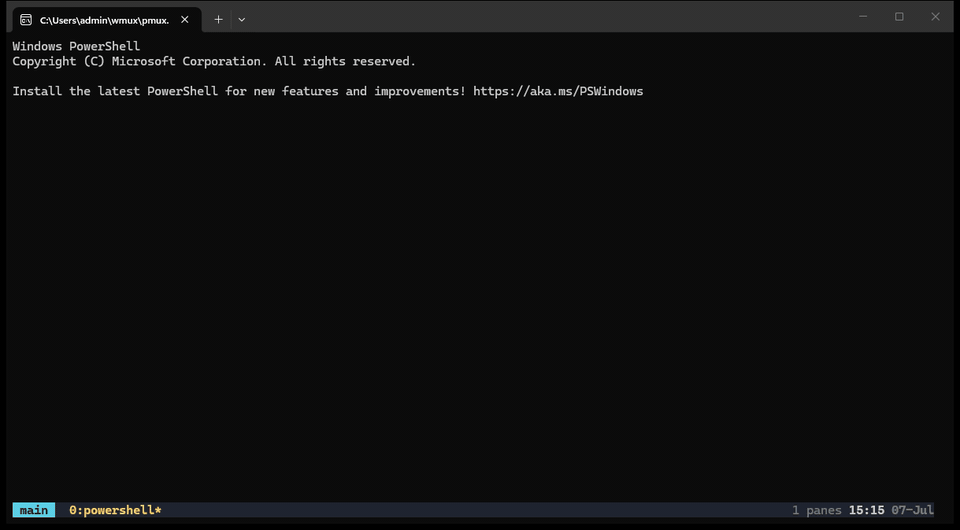
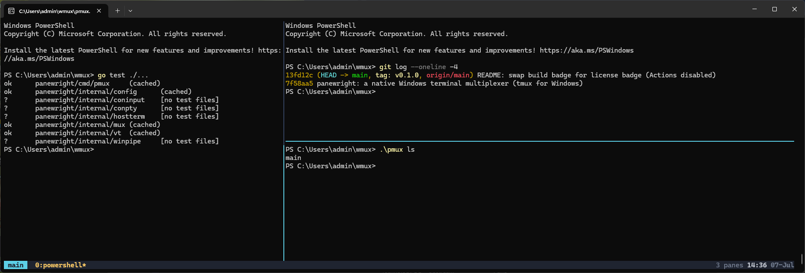

# panewright — tmux for Windows

[](https://github.com/avinashbn2/panewright/releases)
[](LICENSE)


**panewright is [tmux](https://github.com/tmux/tmux) for Windows** — a
terminal multiplexer built natively on the
[ConPTY](https://learn.microsoft.com/en-us/windows/console/creating-a-pseudoconsole-session)
pseudo-console API. Sessions that survive closing your terminal, windows,
split panes, copy mode, mouse support, and your existing `.tmux.conf` —
as a single self-contained binary with no runtime dependencies. Not
tmux-under-Cygwin or WSL: a fresh implementation speaking the Windows console
APIs directly, with tmux's key bindings, commands, and configuration language.

The project is *panewright* (a *wright* is a maker — playwright, shipwright);
**the command is `pmux`**, kept short for typing, the way ripgrep installs as
`rg`.

If you know tmux, you already know pmux: `Ctrl-B c` opens a window, `Ctrl-B %`
splits, `Ctrl-B d` detaches, `pmux attach` picks your shells back up right
where they were.



*The demo: start a dev server in a pane, split, work — then **detach**. The
window is gone, but the server keeps serving (watch its log after
reattaching: two requests arrived while no terminal existed). `pmux attach`
brings everything back.*

## Features

- **Detach & reattach** — tmux's client/server split. Your shells live in a
  background server process; close or detach the client and `pmux attach`
  later picks up exactly where you left off.
- **Sessions** — create, name, list, and kill independent sessions.
- **Windows** — multiple shell windows per session, switch instantly, faithful
  repaint.
- **Split panes** — tile a window into panes (side by side / stacked), with
  box-drawing borders, an active-pane highlight, zoom, swap, rotate, and layout
  presets.
- **Copy mode** — vi-style cursor movement over the scrollback, selection, and
  copy/paste through the Windows clipboard.
- **Mouse** — click to select a pane, drag a divider to resize, wheel to
  scroll.
- **Status bar** — tmux-style window list, fully themeable (truecolor,
  256-color, format strings — see [Theming](#theming)).
- **tmux configuration** — a practical subset of `.tmux.conf`: prefix,
  `bind`/`unbind`, options, `source-file`, `if-shell`, command sequences.
- **Command prompt** — `prefix :` opens a tmux-style command line in the
  status bar.
- **Flicker-free rendering** — a diffing compositor only redraws changed
  cells.

## Installation

### From a release

1. Download `pmux-<version>-windows-amd64.zip` from the
   [releases page](https://github.com/avinashbn2/panewright/releases) and unzip it
   somewhere permanent, e.g. `C:\Tools\pmux`.
2. Add that folder to your `PATH` (see below).

### From source

Requires the [Go toolchain](https://go.dev/dl/) (1.21+):

```powershell
git clone https://github.com/avinashbn2/panewright
cd panewright
go build -trimpath -o pmux.exe ./cmd/pmux
go test ./...        # optional: unit tests (VT model, layout, config, styles)
```

### Adding to PATH

Pick one:

- **Settings UI**: Start → "Edit environment variables for your account" →
  select `Path` → *Edit* → *New* → enter the folder containing `pmux.exe`.
- **PowerShell** (persists for your user; open a new terminal afterwards):

  ```powershell
  $dir = "C:\Tools\pmux"
  [Environment]::SetEnvironmentVariable(
      "Path",
      [Environment]::GetEnvironmentVariable("Path", "User") + ";" + $dir,
      "User")
  ```

Verify from a **new** terminal:

```powershell
pmux ls              # -> "no sessions"
```

Works in Windows Terminal, VS Code's terminal, and plain conhost.

## Quick start

```powershell
pmux                      # attach the default session (creating it)
pmux new -s work          # create and attach a named session
pmux attach -t work       # reattach an existing session
pmux ls                   # list running sessions
pmux kill-server -t work  # stop a session's server (and its shells)

pmux cmd.exe              # host a specific shell/command
pmux -f path\to.conf      # load a specific config file
```

The default session hosts PowerShell. Detaching (`prefix d`, or just closing
the terminal) leaves the session's shells running in a hidden background
server process.

## Key bindings

All commands are typed after the **prefix key, `Ctrl-B`** (configurable —
tmux users who prefer `Ctrl-A` see [Configuration](#configuration)):

| Keys | Action |
|------|--------|
| `prefix c` | new window |
| `prefix n` / `p` / `l` | next / previous / last window |
| `prefix 0`–`9` | select window by number |
| `prefix w` | choose window from a list |
| `prefix ,` | rename the current window |
| `prefix v` / `prefix %` | split side by side |
| `prefix h` / `prefix "` | split stacked |
| `prefix ←↑↓→` | move between panes |
| `prefix Ctrl-←↑↓→` | resize the current pane |
| `prefix o` / `;` | next / last pane |
| `prefix q` | display pane numbers (type one to jump) |
| `prefix z` | zoom / unzoom the current pane |
| `prefix Space` | cycle layout presets |
| `prefix {` / `}` | swap pane up / down |
| `prefix Ctrl-O` | rotate panes |
| `prefix !` | break the pane into its own window |
| `prefix x` / `&` | kill pane / window (with confirmation) |
| `prefix [` / `PgUp` | enter copy mode |
| `prefix ]` | paste |
| `prefix :` | command prompt |
| `prefix ?` | list key bindings |
| `prefix t` | clock |
| `prefix d` | detach |
| `prefix Ctrl-B` | send a literal prefix key to the shell |

**Copy mode** uses vi keys: `h j k l` move, `Ctrl-B`/`Ctrl-F` (or
`PgUp`/`PgDn`) page, `g`/`G` jump to top/bottom, `0`/`$` line start/end,
`Space`/`v` start a selection, `y`/`Enter` copy it to the Windows clipboard,
`q`/`Esc` leave.

## Mouse

Mouse support is on by default (disable with `set -g mouse off`):

- **Click** a pane to make it active.
- **Drag a divider** to resize the split on either side of it.
- **Wheel** scrolls the pane's scrollback.

pmux reads native console input records (`ReadConsoleInput`), so mouse works
without relying on the terminal's VT mouse reporting.

## Configuration

pmux loads `~\.pmux.conf` automatically; if it doesn't exist, `~\.tmux.conf`
is used instead — **an existing tmux config carries over unchanged** (unknown
directives are skipped with a warning rather than erroring). An explicit file
can be given with `-f`.

The classic tmux starter:

```tmux
# use Ctrl-A as the prefix, like screen
set -g prefix C-a
bind C-a send-prefix

# rebind splits; \; chains commands in one binding
bind | split-window -h
bind - split-window -v
bind e split-window -h \; select-pane -L

# root bindings (no prefix needed): Alt+arrows move between panes
bind -n M-Left  select-pane -L
bind -n M-Right select-pane -R
bind -n M-Up    select-pane -U
bind -n M-Down  select-pane -D

# behavior
set -g base-index 1
set -g pane-base-index 1
set -g history-limit 5000
set -g renumber-windows on
set -g mouse on

# composition
source-file ~/more.conf
if-shell "where pwsh" "set -g default-command pwsh"
```

**Commands** usable in bindings and at the `prefix :` prompt: `new-window`,
`split-window [-h|-v]`, `select-pane [-L|-R|-U|-D]`, `select-window -t N`,
`next-window`, `previous-window`, `last-window`, `last-pane`, `swap-pane`,
`rotate-window`, `break-pane`, `resize-pane [-L|-R|-U|-D|-Z]`,
`select-layout`, `next-layout`, `kill-pane`, `kill-window`, `kill-server`,
`rename-window`, `copy-mode`, `paste-buffer`, `send-keys`, `send-prefix`,
`choose-window`, `display-panes`, `display-message`, `list-keys`,
`command-prompt`, `confirm-before`, `clock-mode`, `detach-client`, `set`,
`source-file`, `if-shell`.

**Keys**: letters/symbols, `C-x`, `M-x`, named keys (`Up`, `Enter`, `Space`,
`Tab`, `F1`–`F12`, …).

## Theming

The status bar, pane borders, and messages are styled with tmux's option
names and style syntax. Colors can be **named** (`black`, `red`, …,
`brightcyan`), **256-color** (`colour0`–`colour255`), or **24-bit hex**
(`#rrggbb`); attributes are `bold`, `underline`, `reverse` (and their `no`
prefixed inverses). Inside format strings, `#[fg=...,bg=...,bold]` switches
style mid-text and `#[default]` returns to the bar's base style.

Format strings expand:

- **Variables** — `#{session_name}`, `#{window_index}`, `#{window_name}`,
  `#{window_flags}`, `#{pane_index}`, `#{pane_title}`, `#{window_panes}`,
  `#{session_windows}`, `#{window_zoomed_flag}`, `#{host}`, `#{host_short}`,
  `#{client_width}`, `#{client_height}`, `#{version}`
- **Shorthands** — `#S` session, `#I` window index, `#W` window name,
  `#F` flags, `#P` pane index, `#T` pane title, `#H` host
- **Clock** — strftime codes like `%H:%M`, `%d-%b-%y`

A complete theme, ready to paste into `~\.pmux.conf` (this is the look used
in the screenshots — cyan session badge, yellow current-window pill):



```tmux
##### pmux theme: "harbor" — a cool truecolor look ##########################

# status bar base: light text on a deep blue-grey
set -g status-style bg=#1f2430,fg=#c7ccd6

# left: session name badge
set -g status-left "#[bg=#5ccfe6,fg=#1f2430,bold] #S #[default] "
set -g status-left-length 24

# right: pane count + clock
set -g status-right "#[fg=#707a8c]#{window_panes} panes #[fg=#c7ccd6,bold]%H:%M #[fg=#707a8c]%d-%b"
set -g status-right-length 40

# window list: dim inactive, bright pill for the current window
set -g window-status-format "#[fg=#707a8c] #I:#W#F "
set -g window-status-current-format "#[bg=#ffcc66,fg=#1f2430,bold] #I:#W#F "

# pane borders: subtle grey, glowing active border
set -g pane-border-style fg=#33415e
set -g pane-active-border-style fg=#5ccfe6

# status-line messages and prompts
set -g message-style bg=#ffcc66,fg=#1f2430,bold
```

The same options with classic 16-color names (works everywhere, matches your
terminal's palette):

```tmux
##### minimal named-color theme ##############################################
set -g status-style bg=green,fg=black
set -g status-left "[#S] "
set -g status-right "#H %H:%M "
set -g window-status-current-style bg=black,fg=brightgreen,bold
set -g pane-border-style fg=brightblack
set -g pane-active-border-style fg=green
set -g message-style bg=yellow,fg=black
```

Style options can also be changed live from the command prompt — hit
`prefix :` and type e.g. `set -g status-style bg=#5ccfe6,fg=#1f2430`.

**All appearance/behavior options**: `prefix`, `mouse`, `status`,
`status-style` / `status-bg` / `status-fg`, `status-left` / `status-right`
(+ `-length`), `window-status-style`, `window-status-current-style`,
`window-status-format`, `window-status-current-format`, `pane-border-style`,
`pane-active-border-style`, `message-style`, `base-index`, `pane-base-index`,
`history-limit`, `renumber-windows`, `default-command`, `default-shell`,
`display-time`, `display-panes-time`.

## Architecture

```
cmd/pmux            CLI, client, server process, framed pipe protocol
internal/winpipe    named-pipe listener/dialer (one pipe per session)
internal/conpty     ConPTY wrapper (CreatePseudoConsole + process spawn)
internal/hostterm   host console raw mode, UTF-8 code page, size
internal/coninput   native console input records (keyboard + mouse)
internal/vt         a small terminal emulator (screen grid) per pane
internal/config     tmux.conf parser -> prefix, bindings, options
internal/mux        the multiplexer: panes, windows, layout tree, compositor
```

Each **session** is a hidden background server process reachable through a
named pipe (`\\.\pipe\pmux-<name>`). The server owns the shells: each pane is
a child process in its own ConPTY whose output feeds an in-memory
`vt.Screen`. A diffing compositor walks the active window's layout tree, blits
each pane's grid into a full-screen frame, draws dividers and the status bar,
and emits only the cells that changed since the last frame.

The **client** is deliberately thin: it puts the host console into raw VT
mode, streams input records to the server, and writes the server's rendered
frames to stdout. Attaching from a different terminal size just re-renders;
a new client displaces any previous one (tmux's "takeover" behavior).

### Notes on Windows specifics

- **Input** is read as native console records via `ReadConsoleInput` rather
  than as a byte stream. This gives reliable mouse events and lets pmux
  decode keys (modifiers, arrows, function keys) and re-encode them as a
  terminal byte stream for the child shell. It avoids the quirks of
  `ENABLE_VIRTUAL_TERMINAL_INPUT` (where keys arrive as *win32-input-mode*
  sequences and mouse translation is inconsistent).
- **Std-handle propagation**: shells spawned into a ConPTY inherit the
  *server's* standard handles verbatim when those aren't console handles
  (microsoft/terminal#4061). Since Go's `exec` starts the detached server with
  NUL std handles, the server rebinds its own std handles to `CONIN$`/`CONOUT$`
  at startup — otherwise every pane shell would read EOF and exit immediately.
- **UTF-8**: the per-pane terminal emulator decodes multibyte UTF-8 into
  runes, and the console code page is switched to UTF-8 (65001), so
  box-drawing and other Unicode used by TUIs render correctly instead of as
  mojibake.

Set `PMUX_DEBUG=<path>` to capture diagnostic traces (the detached server
logs to `<path>.server`).
